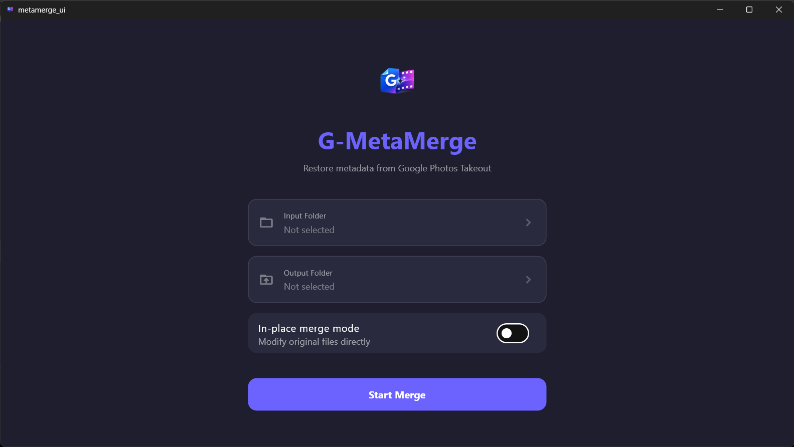
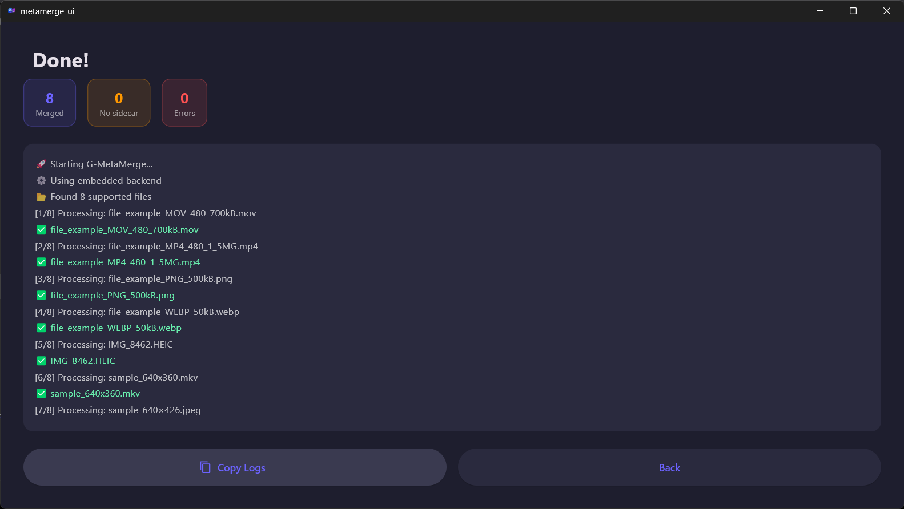

# 🚀 G-MetaMerge

A modern Windows desktop application for restoring lost metadata from Google Photos Takeout exports.

G-MetaMerge automatically merges metadata from Google Photos sidecar JSON files back into your original media files while preserving folder hierarchy, supporting both images and videos, and providing a fully offline GUI experience.

---

# 📥 Downloads

## 🪟 Latest Windows Installer

👉 [Download GMetaMergeSetup.exe](https://github.com/sreeego/G-MetaMerge/releases/tag/v1.0.0)

After downloading:

1. Run installer
2. Complete setup
3. Launch `G-MetaMerge`

---

# ✨ Features

* Restore date and GPS metadata from Google Photos sidecar JSON files
* Supports both images and videos
* Google Photos Takeout compatible
* Preserves original folder hierarchy
* Recursive folder scanning
* Standard output mode for safe processing
* In-place merge mode for direct metadata restoration
* Automatic sidecar JSON cleanup in in-place mode
* Real-time processing logs
* Automatic log file export
* Embedded FFmpeg support for video metadata handling
* Fully offline processing
* No Python or FFmpeg installation required for end users
* Windows desktop GUI

---

# 📦 Supported Formats

| Format      | Extension        | Metadata Supported                 |
| ----------- | ---------------- | ---------------------------------- |
| JPEG        | `.jpg`, `.jpeg`  | Date, GPS, camera info             |
| PNG         | `.png`           | Date, GPS                          |
| WEBP        | `.webp`          | Date, GPS                          |
| HEIC / HEIF | `.heic`, `.heif` | Date, GPS, camera info             |
| TIFF        | `.tiff`          | Date, GPS                          |
| BMP         | `.bmp`           | Date, GPS                          |
| GIF         | `.gif`           | Date, GPS                          |
| MP4         | `.mp4`           | Date, GPS                          |
| MOV         | `.mov`           | Date, GPS                          |
| 3GP         | `.3gp`           | Date, GPS                          |
| MKV         | `.mkv`           | Date only *(container limitation)* |
| AVI         | `.avi`           | Date only *(container limitation)* |
| WMV         | `.wmv`           | Date only *(container limitation)* |

---

# ⚙️ How It Works

Google Photos Takeout exports metadata separately as `.json` sidecar files.

G-MetaMerge:

1. Detects matching sidecar JSON files
2. Extracts metadata
3. Rewrites metadata back into media files
4. Preserves original folder structure
5. Generates logs automatically

---

# 🧩 Modes

## 📁 Standard Mode

Creates a new processed output folder.

Example:

```text id="p3cljh"
Takeout.g-metamerge/
```

Your original files remain untouched.

---

## ⚠️ In-Place Mode

Directly modifies original files instead of creating copies.

This mode:

* Updates metadata directly inside original files
* Deletes successfully merged sidecar JSON files
* Is significantly faster
* Avoids duplicate storage usage

### ⚠️ RISKS

* Original files may become corrupted if interrupted
* Existing metadata may be overwritten
* Changes cannot be undone
* Backups are strongly recommended

---

# 📜 Logs

G-MetaMerge provides:

* Live processing logs
* Error tracking
* Log export
* Copy-to-clipboard support

Generated log example:

```text id="4mjlwm"
g_metamerge_log_2026-05-12T13-57-53.txt
```

---

# 🏗️ Architecture

## 🖥️ Frontend

* Flutter (Windows Desktop)

## ⚙️ Backend

* Embedded Python executable
* Embedded FFmpeg binary

## 🧠 Metadata Handling

* Pillow
* piexif
* FFmpeg

---

# 🔒 Privacy

G-MetaMerge:

* works fully offline
* performs no network requests
* uploads nothing
* stores no analytics
* tracks no user data

---

# 🖼️ Screenshots





---

# 🛠️ Build From Source

## 📋 Requirements

* Flutter SDK
* Python 3
* PyInstaller
* Inno Setup

---

## ⚙️ Build Backend

```bash id="jlwm5z"
pyinstaller --onefile --name g_metamerge g-metamerge.py
```

Copy generated executable:

```text id="jlwm6a"
dist/g_metamerge.exe
```

to:

```text id="jlwm7b"
assets/backend/g_metamerge.exe
```

---

## 🖥️ Build Flutter App

```bash id="jlwm8c"
flutter clean
flutter pub get
flutter build windows
```

---

## 📦 Build Installer

Compile:

```text id="jlwm9d"
installer/setup.iss
```

using:

* Inno Setup

---

# 📁 Project Structure

```text id="jlwm0e"
assets/
 ├── backend/
 ├── ffmpeg/
 └── logo/

installer/
lib/
windows/

g-metamerge.py
pubspec.yaml
README.md
```

---

# 📄 License

GPL-3.0 License
